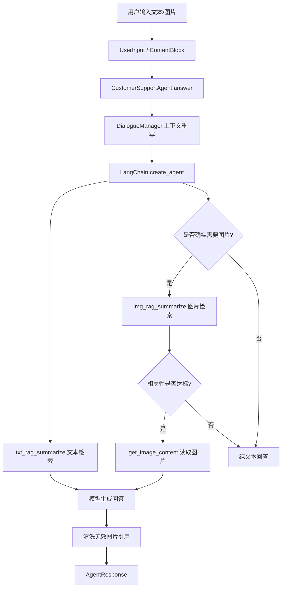

# 多模态客服智能体

本项目是一个面向产品使用手册问答场景的多模态客服智能体。系统基于 LangChain `create_agent` 构建 agent，结合文本/图片向量库、工具调用、会话上下文管理和提示词约束，为用户提供产品使用、故障处理、物流售后等问答能力。

## 核心能力

- 多模态输入：支持用户文本问题和图片输入结构，当前主链路已预留图片理解字段与扩展点。
- 多模态 RAG：使用 Chroma 分别构建文本手册向量库和手册插图向量库。
- 工具调用：agent 可调用 `agent/tools/agent_tools.py` 中注册的工具，包括文本检索、图片检索、图片内容读取等。
- 多轮对话：`DialogueManager` 维护会话历史，并基于上下文重写追问。
- 幻觉抑制：系统提示词要求先查文本资料；图片默认不附带，只有明确需要图示且检索足够相关时才允许返回图片。
- API 服务：提供 FastAPI `/chat` 与 `/health` 接口，支持普通响应和 SSE 流式响应。

## 当前架构

```text
.
├── agent/
│   ├── dialogue/
│   │   └── manager.py                  # 多轮对话历史、上下文重写、问题拆解
│   ├── multimodal/
│   │   └── understanding.py            # 多模态理解的轻量规则实现与扩展点
│   ├── services/
│   │   └── customer_support_agent.py   # create_agent 智能体主编排入口
│   ├── tools/
│   │   ├── agent_tools.py              # agent 可使用的工具集合
│   │   └── middleware.py               # 工具调用监控、动态提示词、中间件
│   └── schemas.py                      # 输入、输出、检索证据、会话等数据结构
├── api/
│   └── server.py                       # FastAPI 服务入口
├── config/
│   ├── chroma.yaml                     # 向量库、数据路径、切分参数
│   ├── prompts.yaml                    # 提示词文件路径
│   └── rag.yaml                        # 模型名称配置
├── data/
│   ├── *.txt                           # 产品手册文本
│   ├── 插图/                           # 手册插图
│   ├── txt_chroma_db/                  # 文本向量库持久化目录
│   └── img_chroma_db/                  # 图片向量库持久化目录
├── model/
│   └── factory.py                      # ChatOpenAI 与多模态 embedding 封装
├── prompts/
│   ├── main_prompt.txt                 # agent 系统提示词
│   ├── rag_summerize.txt               # RAG 总结提示词
│   └── report_prompt.txt               # 报告场景提示词
├── rag/
│   ├── rag_service.py                  # 工具层 RAG 汇总服务
│   ├── knowledge_service.py            # 证据与图片路径解析服务
│   └── vector_store.py                 # Chroma 文本/图片向量库服务
├── tests/
│   └── test_vector_store.py            # vector store 相关测试
├── utils/                              # 配置、文件解析、日志、路径工具
├── main.py                             # 命令行交互入口
└── batch_test.py                       # 批量测试脚本
```

## 处理流程



## 模型与配置

当前模型配置位于 `config/rag.yaml`：

```yaml
chat_model_name: qwen-vl-plus-2025-05-07
img_embedding_model_name: tongyi-embedding-vision-plus
txt_embedding_model_name: text-embedding-v4
```

向量库配置位于 `config/chroma.yaml`：

```yaml
data_path: data
img_path: data/插图
txt_persist_directory: data/txt_chroma_db
img_persist_directory: data/img_chroma_db
txt_k: 5
img_k: 5
chunk_size: 200
chunk_overlap: 20
```

图片检索策略位于 `config/agent.yaml`：

```yaml
image_retrieval:
  min_relevance_score: 0.55
  no_relevant_image_message: 未检索到与当前问题足够相关的图片，请不要在回答中附带图片。
```

运行前需要在 `config/api_keys.env` 中配置 DashScope API Key：

```bash
DASHSCOPE_API_KEY=你的DashScope密钥
KAFU_API_TOKEN=你的接口访问Token
```

API 鉴权 token 同样从 `config/api_keys.env` 读取。

## 安装依赖

项目未固定 `requirements.txt` 时，可按当前代码使用到的核心库安装：

```bash
pip install langchain langchain-openai langchain-community langchain-chroma langgraph chromadb fastapi uvicorn pydantic python-dotenv dashscope pyyaml
```

如果你已经有自己的虚拟环境，建议先在项目根目录激活环境后再运行。

## 构建向量库

文本手册和图片分别进入不同的 Chroma collection。
若更换`config/rag.yaml`中的embedding模型时,需删除向量库`data/img_chroma_db`和`data/txt_chroma_db`
不同的embedding模型存储的向量不同,例如:embedding模型A存储的向量应该由embedding模型A检索

```bash
python rag/vector_store.py
```

该脚本会读取：

- 文本：`data/*.txt`
- 图片：`data/插图/*.png`、`data/插图/*.jpg`
- MD5 去重记录：`md5.text`

注意：如果 `md5.text` 已记录某些文件，重复运行会跳过这些文件。若需要完全重建向量库，需要先备份后清理对应 Chroma 目录和 MD5 记录。

## 运行方式

### 命令行交互

```bash
python main.py
```

输入问题后，程序会构造 `UserInput` 并调用 `CustomerSupportAgent.answer()`。

### API 服务

```bash
python api/server.py
```

默认启动：

```text
http://0.0.0.0:8000
```

健康检查：

```bash
curl http://localhost:8000/health
```

聊天接口：

```bash
curl -X POST http://localhost:8000/chat ^
  -H "Authorization: Bearer 你的接口访问Token" ^
  -H "Content-Type: application/json" ^
  -d "{\"question\":\"相机如何充电？\",\"session_id\":\"demo\",\"stream\":false}"
```

请求体字段：

| 字段 | 类型 | 说明 |
| --- | --- | --- |
| `question` | `string` | 用户问题 |
| `images` | `list[string]` | 图片输入，当前 API 按 base64 字符串接收 |
| `session_id` | `string` | 会话 ID，不传则自动生成 |
| `stream` | `bool` | 是否使用 SSE 流式返回 |

响应示例：

```json
{
  "code": 0,
  "msg": "success",
  "data": {
    "answer": "您好，...",
    "session_id": "demo",
    "timestamp": 1770000000
  }
}
```

## 数据结构

### UserInput

`UserInput` 使用 `contents: list[ContentBlock]` 表示多模态输入，并提供兼容属性：

- `text`：提取文本内容。
- `image_paths`：提取图片路径或图片数据。
- `session_id`：会话 ID。
- `stream`：是否流式响应。
- `metadata`：扩展信息。

推荐通过 `UserInput.from_api(...)` 从 API 参数构造。

### AgentResponse

主要字段：

- `answer`：最终回复。
- `retrievals`：检索证据列表。
- `referenced_images`：最终允许展示的真实图片路径。
- `debug`：调试信息，例如重写后的问题。
- `trace_id`：追踪 ID。

## 图片引用策略

为了避免“无关问题也附图”或模型臆造图片，本项目做了三层限制：

- 提示词层：默认不附图，只有明确需要图示时才允许使用图片工具。
- 工具层：不使用关键词判断用户意图；是否调用图片工具由 agent 结合上下文语义自行决定，工具只按 `min_relevance_score` 过滤向量检索结果。
- 输出层：`CustomerSupportAgent` 会清洗不存在的图片 ID；如果图片文件不存在，会移除 `<PIC>` 和图片列表。

这意味着普通物流、售后、寒暄类问题应返回纯文本，不应包含图片。

## 测试

语法检查：

```bash
python -m py_compile main.py api/server.py agent/schemas.py agent/dialogue/manager.py agent/services/customer_support_agent.py agent/tools/agent_tools.py agent/tools/middleware.py rag/vector_store.py rag/rag_service.py rag/knowledge_service.py model/factory.py
```

运行 vector store 测试：

```bash
python -m unittest tests/test_vector_store.py
```

如果测试与当前 `VectorStoreService` 构造参数不一致，需要同步更新测试用例中的配置字段。

## 扩展方向

- 接入真实视觉理解模型，增强用户上传故障图片识别。
- 为图片向量库补充更强的图文对齐数据，例如手册段落与插图的显式映射。
- 建立自动评测集，覆盖文本召回、图片召回、多轮追问、幻觉率和工具调用正确率。
- 基于客服多轮对话和产品图片问答数据进行多模态微调。
